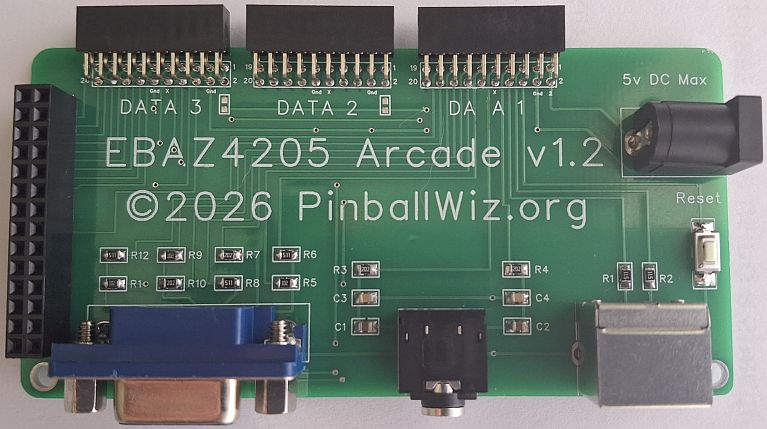
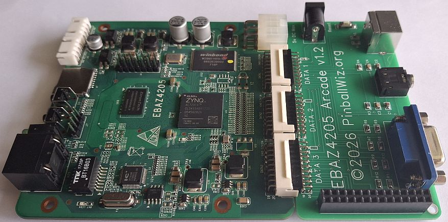

# EBAZ4205 Arcade

This project has now been updated and replaced by the ZYNQ Arcade Project here:  

https://github.com/pinballwizz/ZYNQ-Arcade  

This project has now been kept for archival purposes only.
EBAZ4205 Arcade PCB for the EBAZ4205 ZYNQ 7010 FPGA Board.  
Features 8 Bit VGA, PS2 Keyboard and 2 channel Audio.  
PinballWiz.org 2026
